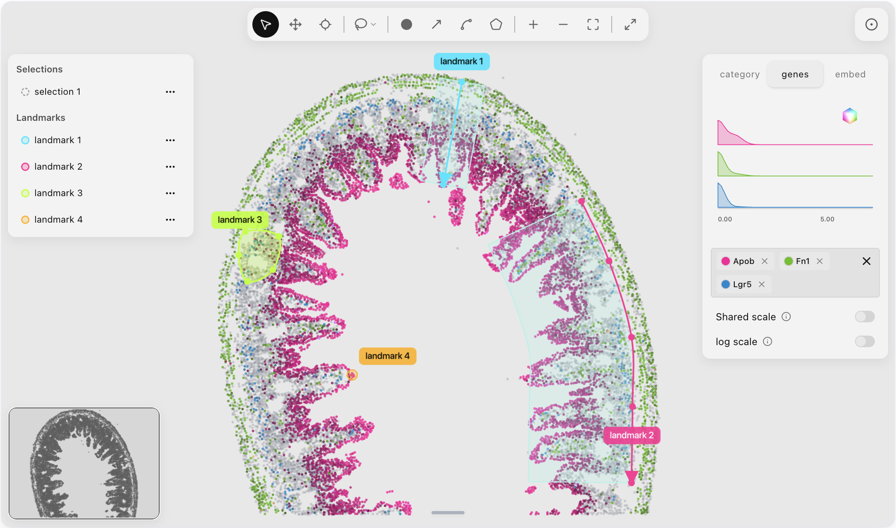

# spatial-rx

Tools for exploring spatial omics data in notebooks — reactive widgets that stay
in sync with your Python analysis.


| Tool | Role | Demo |
| ---- | ---- | ---- |
| **LandmarksWidget** | Draw selections and landmarks on tissue coordinates; measure from the notebook | [](https://molab.marimo.io/github/ckmah/spatial-rx/blob/main/demos/landmarks.py) |
| **GalleryWidget** | Compact card gallery (e.g. analysis recipes / use cases) | [](https://molab.marimo.io/github/ckmah/spatial-rx/blob/main/demos/gallery.py) |


More widgets and helpers may land here over time.

## Install

```bash
pip install spatial-rx
```

From source:

```bash
uv sync --extra demo --group dev
```

## LandmarksWidget

<picture>
  <source media="(prefers-color-scheme: dark)" srcset="assets/landmarks_widget_dark.png" />
  <source media="(prefers-color-scheme: light)" srcset="assets/landmarks_widget_light.png" />
  
</picture>

Draw selections and landmarks on tissue coordinates (lasso, rectangle, ellipse; point,
line, spline, shape). Format data as `AnnData` with `obsm["spatial"]`, then
`LandmarksWidget(adata, color=..., genes=...)`. Neighborhoods expand in the browser.
Persist hits with `get_obs_names` / `selection_mask`.

## GalleryWidget

<picture>
  <source media="(prefers-color-scheme: dark)" srcset="assets/gallery_widget_dark.png" />
  <source media="(prefers-color-scheme: light)" srcset="assets/gallery_widget_light.png" />
  
</picture>

Selectable image cards for recipes or use cases. Synced selection is `selected_index`.
