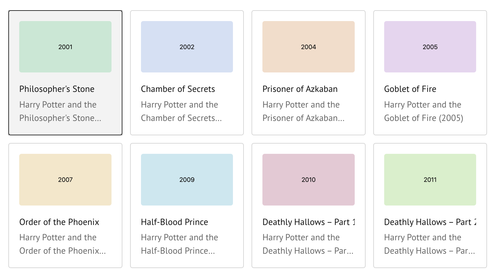

# GalleryWidget

Compact selectable image cards for recipes or use cases. Synced selection is
`selected_index` (`-1` when none).



## Construct

```python
from spatial_rx import GalleryWidget

g = GalleryWidget(
    items=[
        {
            "title": "Landmarks",
            "description": "Draw on tissue coordinates",
            "image": "https://example.com/card.png",  # optional URL or data URL
        },
        {"title": "Recipes"},
    ],
    columns=4,
)
```

Each item requires a non-empty `title`. `description` and `image` are optional.

## Synced state

```python
g.selected_index  # int; -1 when nothing selected
g.items           # list of card dicts
g.columns         # layout columns
```

## Demo

[Open in molab](https://molab.marimo.io/github/ckmah/spatial-rx/blob/main/demos/gallery.py)
