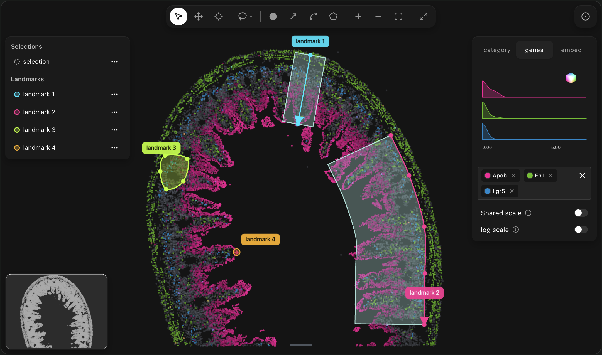

# LandmarksWidget

Draw selections and landmarks on tissue coordinates. The widget holds a
reference to the caller’s `AnnData` and syncs geometry through traitlets.



## Construct

Coordinates must live in `obsm["spatial"]`:

```python
from spatial_rx import LandmarksWidget

w = LandmarksWidget(adata, color="cell_type")
w = LandmarksWidget(adata, color="cell_type", genes=["GeneA", "GeneB"])
```

- `color` — categorical or continuous column used for point coloring
- `genes` — optional gene list for view-only expression coloring; default packs
  every `var_name` for coloring

Chrome follows the notebook cell width. Marker radius is derived from median
nearest-neighbor distance. Neighbor expand runs in the browser.

## Synced notebook API

| Traitlets | Role |
| --- | --- |
| `selections` | Analysis regions (lasso, rectangle, ellipse, …) |
| `landmarks` | Durable annotations (point, line, spline, shape) |
| `selected_kind` / `selected_index` | Current selection in the UI |
| `active_genes` | View-only gene channels (chrome ↔ engine) |

Persist hits with observation names:

```python
obs_names = w.get_obs_names()
# or assign a boolean mask back onto adata.obs
w.assign_obs_mask("in_region")
```

Do not treat positional indices as durable IDs.

## Landmarks vs selections

- **Landmark** — durable geometric annotation. Notebooks can convert to/from a
  GeoDataFrame (`landmarks_to_geodataframe` / `geodataframe_to_landmarks`) and
  place into SpatialData themselves.
- **Selection** — analysis region on the widget; hits via `get_obs_names`. Not
  written to SpatialData in the current M1 contract.

Contributor detail lives in the engineering note
[`docs/landmarks-spatialdata-contract.md`](https://github.com/ckmah/spatial-rx/blob/main/docs/landmarks-spatialdata-contract.md)
in the repository (not mirrored here yet).

## Demo

[Open in molab](https://molab.marimo.io/github/ckmah/spatial-rx/blob/main/demos/landmarks.py)
